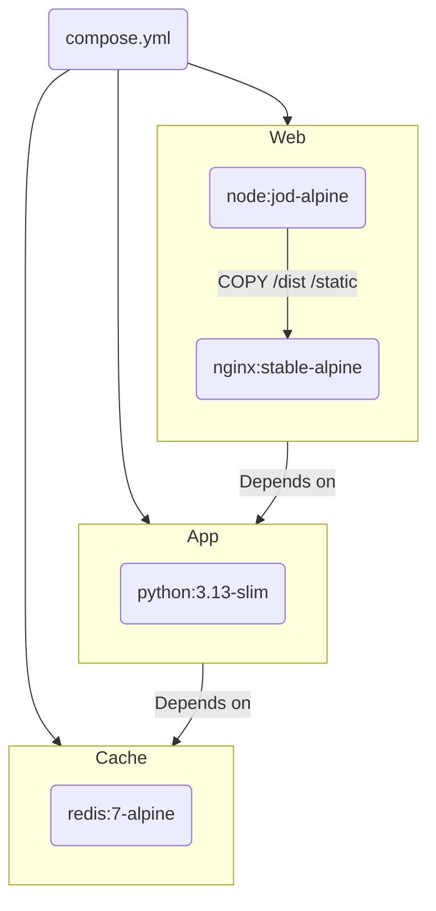
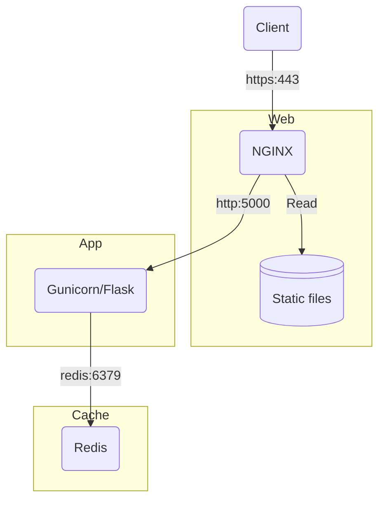

# GOV.UK Frontend Flask


**GOV.UK Frontend Flask is a [community tool](https://design-system.service.gov.uk/community/resources-and-tools/) of the [GOV.UK Design System](https://design-system.service.gov.uk/). The Design System team is not responsible for it and cannot support you with using it. Contact the [maintainers](#contributors) directly if you need [help](#support) or you want to request a feature.**

This is a template [Flask](https://flask.palletsprojects.com) app using the [GOV.UK Frontend](https://frontend.design-system.service.gov.uk/) and [GOV.UK Design System](https://design-system.service.gov.uk/) which is designed to get a new project started quicker. It is also a reference implementation of two core packages:

- [GOV.UK Frontend Jinja](https://github.com/LandRegistry/govuk-frontend-jinja) which provides Jinja macros of GOV.UK components
- [GOV.UK Frontend WTForms](https://github.com/LandRegistry/govuk-frontend-wtf) which provides WTForms widgets to integrate the above Jinja macros into form generation and validation

The app is provided intentionally bare, with just the essential parts that all services need, such as error pages, accessibility statement, cookie banner, cookie page and privacy notice. It uses a number of other packages to provide the [features](#features) described below with sensible and best-practice defaults.

## Prerequisites

### Required

- Docker

## Getting started

### Create a new repository

[Create a new repository](https://github.com/LandRegistry/govuk-frontend-flask/generate) using this template, with the same directory structure and files. Then clone a local copy of your newly created repository.

### Set local environment variables

In the `compose.yml` file you will find a number of environment variables. These are injected as global variables into the app and pre-populated into page templates as appropriate. Enter your specific service information for the following:

- CONTACT_EMAIL
- CONTACT_PHONE
- DEPARTMENT_NAME
- DEPARTMENT_URL
- SERVICE_NAME
- SERVICE_PHASE
- SERVICE_URL

You must also set a new unique `SECRET_KEY`, which is used to securely sign the session cookie and CSRF tokens. It should be a long random `bytes` or `str`. You can use the output of this Python command to generate a new key:

```shell
python -c 'import secrets; print(secrets.token_hex())'
```

### Run containers

```shell
docker compose up --build --watch
```

You should now have the app running on <https://localhost/>. Accept the browsers security warning due to the self-signed HTTPS certificate to continue.

## Testing

To run the tests:

```shell
python -m pytest --cov=app --cov-report=term-missing --cov-branch
```

## Build



## Environment



## Features

Please refer to the specific packages documentation for more details.

### Forms generation and validation

Uses [Flask WTF](https://flask-wtf.readthedocs.io/en/stable/) and [WTForms](https://wtforms.readthedocs.io) to define and validate forms. Forms are rendered in your template using regular Jinja syntax.

### Form error handling

If a submitted form has any validation errors, an [error summary component](https://design-system.service.gov.uk/components/error-summary/) is shown at the top of the page, along with individual field [error messages](https://design-system.service.gov.uk/components/error-message/). This follows the GOV.UK Design System [validation pattern](https://design-system.service.gov.uk/patterns/validation/) and is built into the base page template.

### Flash messages

Messages created with Flask's `flash` function will be rendered using the GOV.UK Design System [notification banner component](https://design-system.service.gov.uk/components/notification-banner/). By default the blue "important" banner style will be used, unless a category of "success" is passed to use the green version.

### CSRF protection

Uses [Flask WTF](https://flask-wtf.readthedocs.io/en/stable/) to enable [Cross Site Request Forgery](https://en.wikipedia.org/wiki/Cross-site_request_forgery) protection per form and for the whole app.

CSRF errors are handled by creating a [flash message](#flash-messages) notification banner to inform the user that the form they submitted has expired.

### HTTP security headers

- Forces all connections to `https`.
- Enables [HTTP Strict Transport Security](https://developer.mozilla.org/en-US/docs/Web/HTTP/Headers/Strict-Transport-Security).
- Sets Flask's session cookie to `secure`, so it will never be set if your application is somehow accessed via a non-secure connection.
- Sets Flask's session cookie to `httponly`, preventing JavaScript from being able to access its content.
- Sets [X-Frame-Options](https://developer.mozilla.org/en-US/docs/Web/HTTP/Headers/X-Frame-Options) to `SAMEORIGIN` to avoid [clickjacking](https://en.wikipedia.org/wiki/Clickjacking).
- Sets [X-Content-Type-Options](https://developer.mozilla.org/en-US/docs/Web/HTTP/Headers/X-Content-Type-Options) to prevent content type sniffing.
- Sets a strict [Referrer-Policy](https://developer.mozilla.org/en-US/docs/Web/HTTP/Headers/Referrer-Policy) of `strict-origin-when-cross-origin` that governs which referrer information should be included with requests made.

### Content Security Policy

A strict [Content Security Policy](https://developer.mozilla.org/en-US/docs/Web/HTTP/CSP) (CSP) is set to mitigate [Cross Site Scripting](https://developer.mozilla.org/en-US/docs/Web/Security/Types_of_attacks#cross-site_scripting_xss) (XSS) and packet sniffing attacks. This prevents loading any resources that are not in the same domain as the application by default.

### Permissions Policy

A strict [Permissions Policy](https://developer.mozilla.org/en-US/docs/Web/HTTP/Headers/Permissions-Policy) is set to deny the use of browser features by default.

### Rate limiting

Uses [Flask Limiter](https://flask-limiter.readthedocs.io/en/stable/) to set request rate limits on routes. The default rate limit is 2 requests per second _and_ 60 requests per minute (whichever is hit first) based on the client's remote IP address. Every time a request exceeds the rate limit, the view function will not get called and instead a [HTTP 429](https://developer.mozilla.org/en-US/docs/Web/HTTP/Status/429) status will be returned.

Rate limit storage can be backed by [Redis](https://redis.io/) using the `RATELIMIT_STORAGE_URL` config value in `config.py`, or fall back to in-memory if not present. Rate limit information will also be added to various [response headers](https://flask-limiter.readthedocs.io/en/stable/#rate-limiting-headers).

## Contributors

- [Matt Shaw](https://github.com/matthew-shaw) (Primary maintainer)

## Support

This software is provided _"as-is"_ without warranty. Support is provided on a _"best endeavours"_ basis by the maintainers and open source community.

If you are a civil servant you can sign up to the [UK Government Digital Slack](https://ukgovernmentdigital.slack.com/signup) workspace to contact the maintainers listed [above](#contributors) and the community of people using this project in the [#govuk-design-system](https://ukgovernmentdigital.slack.com/archives/C6DMEH5R6) channel.

Otherwise, please see the [contribution guidelines](CONTRIBUTING.md) for how to raise a bug report or feature request.
