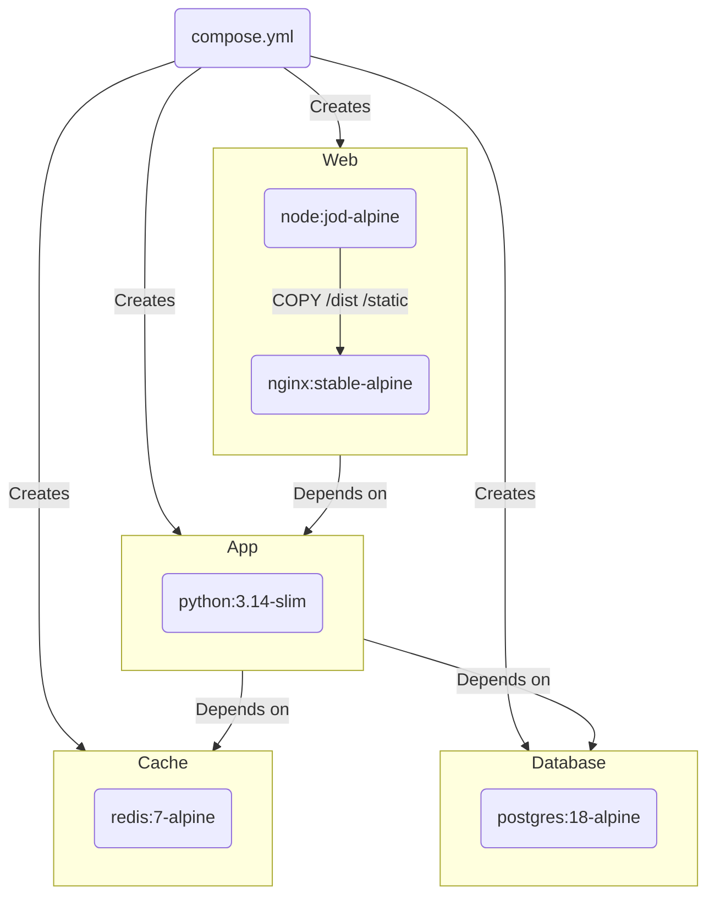
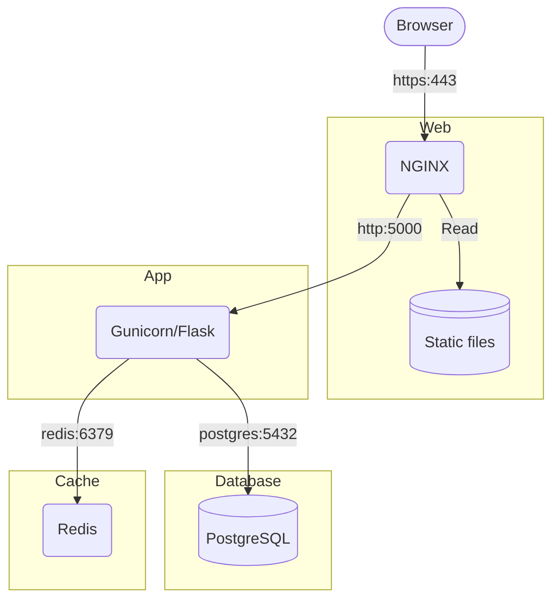

# GOV.UK Frontend - Flask App Template

Start building **accessible**, **secure**, **production-ready** and **maintainable** GOV.UK-style services, fast.

A [Flask](https://flask.palletsprojects.com) application integrating the [GOV.UK Design System](https://design-system.service.gov.uk/) with a realistic, containerised stack.

> **GOV.UK Frontend Flask App Template is a [community tool](https://design-system.service.gov.uk/community/resources-and-tools/) of the [GOV.UK Design System](https://design-system.service.gov.uk/). The Design System team is not responsible for it and cannot support you with using it. Contact the [maintainers](#contributors) directly if you need [help](#support) or you want to request a feature.**

## Highlights

- **GOV.UK components built in** – Accessible [Jinja templates](https://github.com/LandRegistry/govuk-frontend-jinja) and [WTForms helpers](https://github.com/LandRegistry/govuk-frontend-wtf) for compliant UI and forms.  
- **Secure Flask foundation** – HTTPS, CSRF, CSP, rate limits, [SQLAlchemy](https://www.sqlalchemy.org/) and migrations ready to go.  
- **Containerised by default** – [Nginx](https://nginx.org/en/) , [PostgreSQL](https://www.postgresql.org/), [Redis](https://redis.io/) and [Node](https://nodejs.org/en) pipeline managed via [Docker Compose](https://docs.docker.com/compose/).  
- **Fast, lean builds** – Multi-stage Dockerfiles, wheel caching, non-root runtime, and CI via [GitHub Actions](https://github.com/features/actions).  
- **Compliance-ready pages** – 404/500 errors, cookie banner, accessibility statement and privacy notice included.  
- **Developer-first setup** – Example blueprints, templates, macros, and GOV.UK-style flash messages for instant feedback.

## Security

Secure by default with hardened containers, strong HTTP headers and built-in rate limiting.

- Applies strict CSP, HSTS, and other security headers.
- CSRF protection via Flask-WTF, with safe error handling.
- Rate limiting backed by Redis using Flask-Limiter.
- Non-root containers with read-only filesystem for runtime services.
- Secrets and credentials injected via environment variables (no in-repo secrets).
- Dependency scanning and Python version pinning via CI workflows.

## Performance

Optimised for speed and reliability through caching, minimal layers and lean builds.

- Multi-stage Docker builds minimise image size and attack surface.
- Static assets compiled once and cached efficiently.
- Connection pooling for SQLAlchemy database access.
- Redis caching support for transient or computed data.
- Nginx configured for compression and cache control.
- CI validates image build times and wheel caching efficiency.

## Developer Experience

Built to feel frictionless for rapid iteration, testing and deployment.

- Works identically across local and production environments.
- Uses docker compose watch for hot reloads of Python and static assets.
- Includes blueprints, forms, templates and example routes to extend quickly.
- Built-in error pages, logging and debug toolbar (development mode).
- Extensive comments and .env.example for easy onboarding.
- CI workflows for linting, tests, builds and security scans.

## Requirements

- Docker (Engine & Compose)  

## Quick start

### 1. Create a new repository

[Create a new repository](https://github.com/LandRegistry/govuk-frontend-flask/generate) using this template, with the same directory structure and files. Then clone a local copy of your newly created repository.

### 2. Configure environment  

Create a `.env` file in the root of the repo and enter your specific config based on this example:

```dotenv
CONTACT_EMAIL=[contact email]
CONTACT_PHONE=[contact phone]
DEPARTMENT_NAME=[name of department]
DEPARTMENT_URL=[url of department]
POSTGRES_DB=db
POSTGRES_HOST=db
POSTGRES_PASSWORD=db_password
POSTGRES_PORT=5432
POSTGRES_USER=db_user
REDIS_HOST=cache
REDIS_PORT=6379
SECRET_KEY=[see below]
SERVICE_NAME=[name of service]
SERVICE_PHASE=[phase]
SERVICE_URL=[url of service]
```

You **must** set a new `SECRET_KEY`, which is used to securely sign the session cookie and CSRF tokens. It should be a long random `bytes` or `str`. You can use the output of this Python command to generate a new key:

```shell
python -c 'import secrets; print(secrets.token_hex())'
```

### 3. Start the stack

```shell
docker compose up --build
```

Visit <https://localhost/> and accept the browser’s security warning.

Hot reloading is supported via:

```shell
docker compose watch
```

> **Note**: `docker compose watch` requires Docker Compose v2.22 or newer.

## Testing

Run unit tests and measure coverage locally:

```shell
python -m pytest --cov=app --cov-report=term-missing --cov-branch
```

## Environment

| Service    | Role                              | Container | Port exposed     |
| ---------- | --------------------------------- | --------- | ---------------- |
| Nginx      | Reverse proxy + HTTPS termination | `web`     | 443 (HTTPS) / 80 |
| Flask      | Web framework                     | `app`     | 5000             |
| PostgreSQL | Relational database               | `db`      | 5432             |
| Redis      | Caching + rate limiting backend   | `cache`   | 6379             |

## Architecture

### Container stack

This project uses Docker Compose to provision containers:



### Request flow



## Maintainers

- [Matt Shaw](https://github.com/matthew-shaw) - Principal Software Developer at HM Land Registry

## Support

This software is provided _"as-is"_ without warranty. Support is provided on a _"best endeavours"_ basis by the maintainers and open source community.

For questions or suggestions, reach out to the maintainers listed [above](#maintainers) and the community of people using this project in the [#govuk-design-system](https://ukgovernmentdigital.slack.com/archives/C6DMEH5R6) Slack channel.

Otherwise, please see the [contribution guidelines](CONTRIBUTING.md) for how to raise a bug report or feature request.
